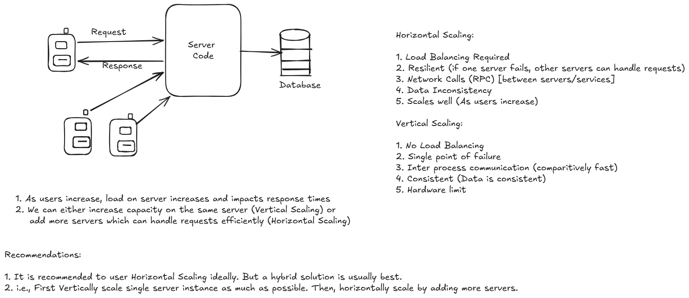

# ⚖️ Horizontal vs Vertical Scaling

## 📌 Problem

Consider a backend system exposing APIs (e.g., `GET /posts`, `POST /upload`) used by web/mobile clients:

* Initially, a **single server + database** handles all API requests
* As traffic grows, the server starts experiencing:

    * Higher latency
    * Increased CPU/memory usage

### As the number of users increases:

* Server load increases
* Response time degrades

### Solutions:

1. Increase capacity of a single server (**Vertical Scaling**)
2. Add more servers to distribute load (**Horizontal Scaling**)

---

## ➕ Horizontal Scaling (Scale Out)

> Add more machines/instances to handle traffic

### Key Points:

* Requires **Load Balancer**
* Highly **resilient** (failure of one server doesn’t stop the system)
* Involves **network communication** (RPC between services)
* Can lead to **data inconsistency** (needs replication strategies)
* **Scales well** for large systems

### 👍 Pros:

* Better fault tolerance
* Practically unlimited scaling
* Ideal for distributed systems

### 👎 Cons:

* Complex architecture
* Requires data partitioning (sharding)
* Debugging and monitoring are harder

---

## ⬆️ Vertical Scaling (Scale Up)

> Increase resources (CPU, RAM) of a single machine

### Key Points:

* No load balancing required
* **Single point of failure**
* Faster **in-process communication**
* Strong **data consistency**
* Limited by **hardware capacity**

### 👍 Pros:

* Simple to implement
* Easier to maintain
* No distributed system complexity

### 👎 Cons:

* Hardware limits
* Possible downtime during upgrades
* Not fault tolerant

---

## 🔄 Quick Comparison

| Feature         | Horizontal Scaling | Vertical Scaling      |
| --------------- | ------------------ | --------------------- |
| Scaling Method  | Add more servers   | Upgrade single server |
| Fault Tolerance | High               | Low                   |
| Complexity      | High               | Low                   |
| Scalability     | High               | Limited               |
| Cost Efficiency | Better at scale    | Expensive at high end |

---

## ✅ Recommendation

* Prefer **Horizontal Scaling** for modern systems
* Use a **hybrid approach**:

    1. Scale vertically first (maximize single instance)
    2. Then scale horizontally as traffic grows

---

## 💡 Tip

* Start simple (vertical scaling)
* Move to distributed systems only when required

---
## 📊 Additional Reference

---

🔗 Reference Video: System Design BASICS: Horizontal vs. Vertical Scaling by Gaurav Sen
[https://www.youtube.com/watch?v=xpDnVSmNFX0](https://www.youtube.com/watch?v=xpDnVSmNFX0)

---